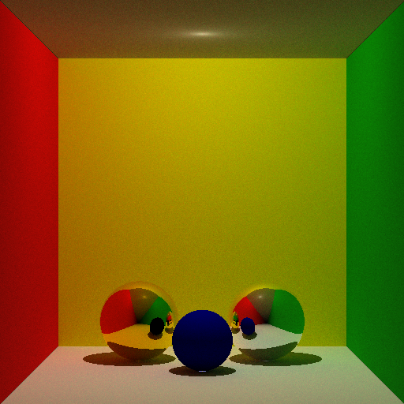

RayStudio
A path-tracing based ray tracer that runs in your browser.
The renderer, written in C, is compiled into WebAssembly (WASM), allowing you to edit scenes and render directly through an HTML-based UI.

Demo
Rendering Examples

Features
C-based path tracer running via WASM

Supports placement of Spheres, Infinite Planes, Limited Planes, Cylinders, and Light Sources

Supports SOLID / METAL materials

TOP / FRONT / SIDE triple-view to verify object placement

Save and load scenes via JSON files

Object ON/OFF toggle, duplication, and drag-and-drop reordering

Zoom functionality for rendering results and PNG export

Undo support via Ctrl+Z or the Undo button

How to Use (For non-programmers)
Open the site from here

Select an object from the list on the left to edit its properties

Only objects set to "ON" will be rendered

Adjust sample counts and resolution in the Settings tab

Click the "Render" button to see the result

Use the 💾 button to save as a PNG

How to Build (For developers)
Prerequisites
Emscripten 3.0 or higher

Compilation
PowerShell
emcc main.c -o renderer.js \
  -s EXPORTED_FUNCTIONS="['_render','_get_buffer_size','_set_object','_set_object_count','_set_camera']" \
  -s EXPORTED_RUNTIME_METHODS="['ccall','cwrap','HEAPU8']" \
  -s ALLOW_MEMORY_GROWTH=1 \
  -O2
Alternatively, run the included compile.ps1:

PowerShell
powershell -ExecutionPolicy Bypass -File compile.ps1
Running Locally
Bash
python -m http.server 8080
Open http://localhost:8080 in your browser.

File Structure
index.html          # UI
renderer.js         # WASM wrapper (generated by emcc)
renderer.wasm       # Compiled renderer
main.c              # Renderer core (entry point for WASM)
struct_vec.h        # Vector and structure definitions
intersection.h      # Intersection testing
intersectionpoint.h # Intersection point processing
serch_light_random_d.h # Direct light and random reflection
compile.ps1         # Compilation script
Technical Mechanics
Samples each pixel by casting rays using the raytracing (path-tracing) method

Direct light sampling (including shadow testing)

Indirect lighting via random hemispherical sampling

METAL material uses specular reflection; SOLID uses Lambertian reflection

License
MIT
